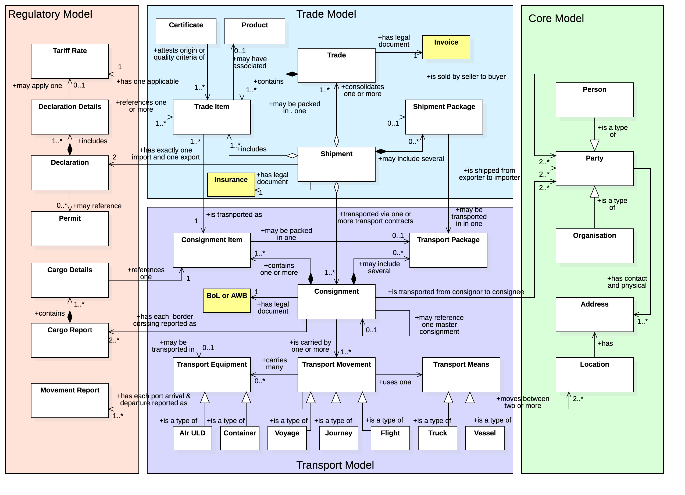

# Semantic Specs

The scope of semantic specifications on this site is the the full internaitonal supply chain as outlined in the diagram.

* Financial processes such as insiurances and letters of credit
* Trade processes such as ordering, invoicing, and shipping notices.
* Transport processes including consignments, house & master bills, and logistics movements.
* Regulatory processes including declarations, certificates, and permits.

# Reference Model

A clear understanding of the key entities and their relationships can help to make sense of the complex business of the international supply chain.  One of the most important ideas is to very clearly separate key concepts in the trade domain (such as a "shipment") from those in the transport domain (such as a "consignment") - and to understand how they both relate to the regulatory domain.

## Trade Domain

A **Shipment** (trade delivery) is an identifiable collection of one or more **Trade Items** (available to be) transported together from the **Seller** to the **Buyer**:

* A Shipment can only be destined for one Buyer
* A Shipment can be made up of some or all Trade Items from one or more Sales Orders
* A Shipment can have only one Customs UCR
* A shipment may form part or all of a Consignment or may be transported in different Consignments.

## Transport Domain

A **Consignment** (transport contract) is a separately identifiable collection of **Consignment Items** (available to be) transported from one **Consignor** to one **Consignee** via one or more modes of transport as specified in one single transport service contractual document (ie a Bill of Lading or Airway Bill):

* A Consignment can only have one Transport Service Buyer and one Transport Service Provider
* A Consignment can only have one Consignor and one Consignee
* The Transport Service Buyer can be either the Consignor or the Consignee
* A Consignment is made up of one or more Consignment Items
* A Consignment can be made up of some or all Trade Items (aggregated into Consignment Items) from one or more Shipments

## Regulatory Domain

The role of the regulator is to control the flow of goods accross their borders, facilitating trade in the export direction and collecting duties and managing risk in the import direction. All regulatory reporting obligations can be mapped neatly to existing industry trade and transport domain data.

* A **Movement report** is provided by one carrier and includes the scheduled, estimated or actual arrive or departure time of one **Transport Means** at one port within the regulator jurisdiction. It maps to a **Transport Movement**.
* A **Cargo Report** is provided by one carrier (at master / ocean bill level) or by one freight forwarder (at house bill level) and includes the cargo manifest information.  It is provided to both the exporting and importing regulator and and maps to one **Consignment**.
* A **Declaration** is provided by the importer or their agent for import processes and by the exporter or other agenct for export processes. It contains item level description and cost information and is used to compute duty obligations and permit requirements. It maps to one **Shipment**.

# The API "Town Plan".

The high level international supply chain reference model is detailed within each domain as described below. Click on any of the domains to get a business overview of the domain and view the data models and JSON-LD dictionaries - or click on a resource to go straight to the reference API specification. 



## JSON-LD Dictionaries

All domain specific data dictionaries are constructed from the UN/CEFACT reference data mdoels and code lists. These are published as browsable models and as JSON-LD linked data models in accordance with the [dictionary](https://edi3.org/dictionary/) publishing rules. The "Javascript Object Notation" (JSON) is a web freindly and human readable syntax for the representation of structured data.  JSOMN-LD (the "LD" stands for "Linked Data") provides a way to attach consistent semantic meaning to data elements in any data exchange. Essentially, a consumer can understand a message because its elements refernece a definition in an online dictionary. It also provides a way to describe relationships between data elements so that consumers can follow a trail of linked data to gather aggregated data that meets their needs. 

Implementers are encouraged to tag data in their web pages or exchanged documents with the relevant JSON-LD context term in order to support semantic interoperability at dictionary level. Imnplementations that have mapped every element in their pages or messages that has an equivalent definition in a CEFACT JSON-LD context can claim **dictionary compliance**.

## Reference REST APIs

An "Application Programming Interface" (API) is the machine readable equivalent of a web page and, in the web development world, is the logical equivalent of an EDI document (although APIs are usually more granular). "Representational State Transfer" (REST) is an API design style that breaks down complex domains into discrete business "resources" and then allows consumers to interact with them using simple web protocols. Each entity in the international supply chain reference data model can be modelled as a REST API "resource" that has a standard data model and state lifecycle. Although conceptually similar to an EDI message, the web API model has a fundamental difference. In stead of the same information being repeatedly re-ackaged and exchanged between two parties as lage document, consumers of APIs gather required information by going to the sources of truth. Web APIs are a "publish once, consume many times" model whilst EDI documents are more like a "create once and copy & paste many times" model.

Implementers are encouraged to re-use the CEFACT reference API designs in their own web APIs. In most cases, implementers will extend the refererence APIs in order to provide additonal business value to their customers. However, so long as the extensions are non-breaking and their interfaces successfully pass the automated test cases provided with each reference API, implementers may claim **interface compliance**.

## Code Lists

Code lists such as ISO-3166 list of country codes or the UN/LOCODE list of location codes provide an important way for systems to have the same understanding of the meaning of data values. For example, rather than using a free text field for "Port" that might be populated in all kinds of different ways (eg "Brisbane", "Brisbane Port", "Port of Brisbane", etc) if all implementers agree to only use allowed values from the UN/LOCODE list than all will use "AUBNE". Code lists are managed by each domain and are published as downloadable data sets and as consumable reference data APIs.

