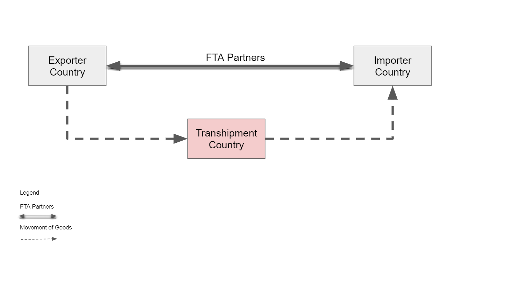
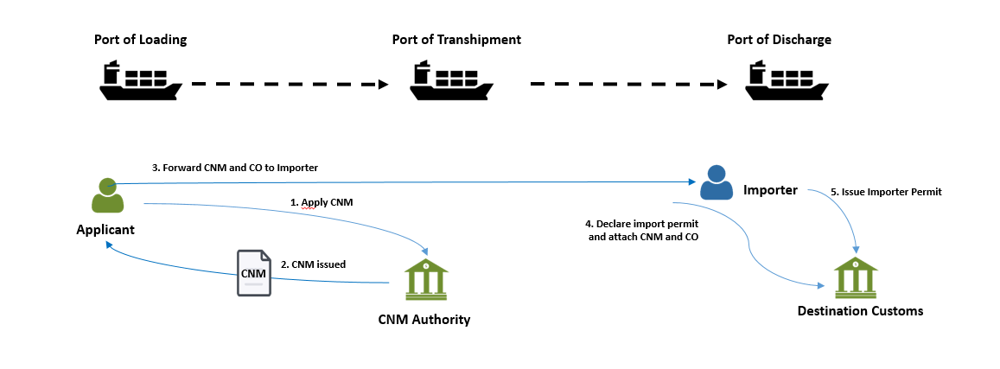
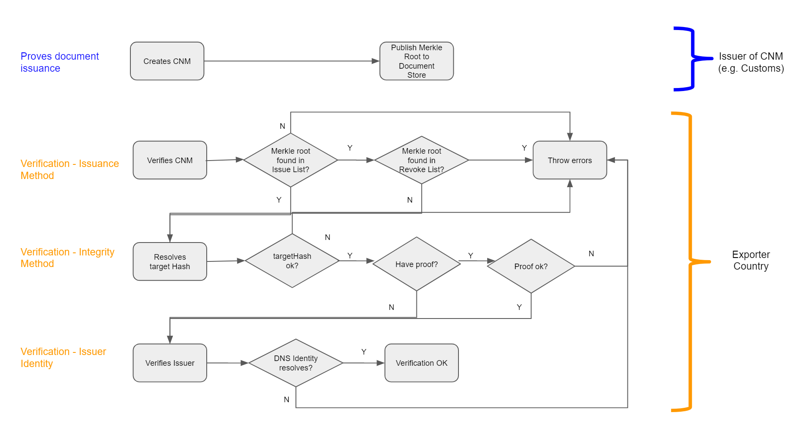
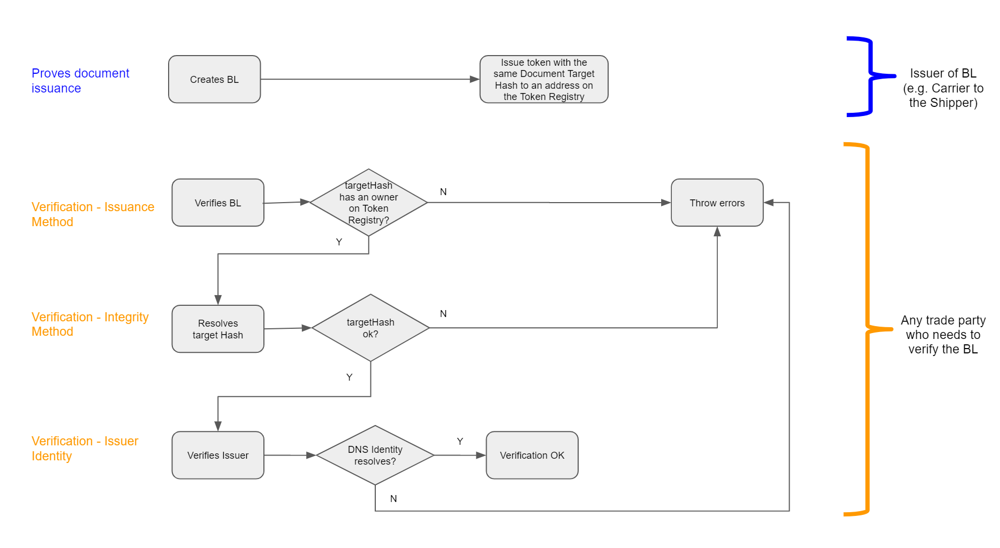

# 1. Abstract

This document describes the technical specifications for notarisation of trade documents using open-source solution leveraging on Distributed Ledger Technology (DLT). This allows end users receiving the document to verify the provenance and integrity of the document. 

The use of such technology offers several advantages. 

- There is no proprietary lock-in; solution will be open-source which lowers barriers of entry to market

- There is no centralised infrastructure (governance/sovereignty); thus, there would not be any single entity in charge of the verification/data that eliminates the trust concern of which authority will have all the trade information in trade world especially when cross-border trading is involved

- Elevates automated trade document processing; allows for any parties in the supply chain to issue trade documents, and for anyone to quickly check the validity of a digital trade documents. This will in time make trade facilitation easier and smoother for the whole supply chain workflow

- Connecting the disconnected world (digital standard); allowing isolated eco-systems to be interoperable


# 2. Introduction

Before digital transformation transpired, trade documents require a lot of administrative burden resulting in an increase in time and cost of manual verification. With the emergence of digital technologies in the trade world, it has changed the way we work and helped to improve operational efficiency across supply chains.

Trade has grown remarkably over the last century with the trade world having numerous isolated ecosystems. Such system isolations resulted in individual systems not being able to verify trade documents from other ecosystems.

Lack of trust in the data is another major contributing factor that hinders global trade facilitation and the move to true digitalization of the supply chain. Paperless initiatives are yet to be widely adopted. For example, in sea freight, Bill of Lading is still made up of three originals and require six copies and digitized formats are still unacceptable for many parties.<sup id="footnote1">[[1]](#f1)</sup> 

There has always been an inherent lack of trust between buyers, sellers, supply chain participants, agencies and governments. Due to this layer of trust, work processes such as document verification is still heavily reliant on the use of papers.<sup id="footnote2">[[2]](#f2)</sup>

Current forms of digital document are neither tamper-proof nor have provenance, resulting in digitalised documents still falling back to the paper documents at some point of the supply chain flow. Thus, we need to have a solution that allows trade documents to be cryptographically trustworthy and can be verified independently.

A major cultural and paradigm shift in the trade world has taken shape since the introduction of Blockchain almost a decade ago. Blockchain, which is a form of DLT offers opportunities to increase reliability and security of trade transactions.<sup id="footnote2">[[2]](#f2)</sup>

As we embark into the Blockchain to facilitate greater transparency, portability of information and greater operational efficiency, trade documents (also known as OpenAttestation (OA) <sup id="footnote3">[[3]](#f3)</sup>  documents in this context) can now be notarised digitally and allowed tracing on the provenance and verification of digitally issued documents. This notarisation makes use of a framework to format data so that it can be fingerprinted, and then notarised on a trusted platform, such as the Ethereum blockchain.


## 2.1 Goals

The following are features that would faciliate on the suggested notarisation method:

- Standard wrapper for document (see JSON schema 3)
- Support multiple document types
- Verify issuer’s identity (provenance)
- Tamper-proof document integrity (integrity)
- Selective data disclosure (data obfuscation)
- Standard & best-practices for storage & transmission 
- Support multiple backend (ETH/API/Private Blockchain)
- Compatible with W3C Verifiable Claims

## 2.2 Architectural Principles

|ID|Principle|Rationale|
|--|---------|---------|
|P1|Verifiable document provenance| A document SHOULD provide proof of its origin to allow the document viewer to know the source of the document (e.g. the issuer). |
|P2|Verifiable document integrity|A document SHOULD be tamper-proof. In the case of a tampered document, it should be easy to indicate tampering.|
|P3|Allows decentralised creation|Anyone MAY create a document without permission of any other entity.|
|P4|Supports multiple distributed ledger types & networks|A single global uber-ledger would need to pick a technology winner, would restrict the ability to introduce non breaking extensions, would present a high value attack target, and is unlikely to be supported by every nation.|
|P5|Coexist nicely with paper processes|A switch from paper processes to notarised digital documents will not happen overnight. Therefore the notarised digital document should add value to existing paper processes by allowing easy switching between the digital and paper documents.|
|P6|Allows decentralised identifier|Any document issuers MAY tie existing identifiers to themselves. Document verifiers MAY choose different ways to resolve that identifier.|
|P7|Allows payload agnostics|The document SHOULD allow for any payload or media to be part of the document.|
|P8|Assume on-chain data is public|The notarised document stores proof of document issuance status on public or private ledgers. In either case, it should be assumed that on-chain data is public as the privacy of on-chain data cannot be guaranteed with multiple participants on the network that may not be fully trusted.|
|P9|Supports human readable view|The document SHOULD be presented in ways that are familiar to humans who were processing the physical copies of that document. The creator of the document should be allowed to define how the document should be presented visually.|
|P10|Supports machine readable data|The document SHOULD separate the view and data layer to allow machines to read these data directly to allow for automatic processing of documents.|
|P11|Allows user controlled data disclosure|The presenter of a document SHOULD be allowed to redact parts of the document so as not to reveal all information to the recipient, without causing the integrity check to fail.|

## 2.3 High Level Requirements

|ID|Requirement|Solution Links|
|--|---------|---------|
|R1|The on-chain notary data SHOULD NOT contain sensitive or private information. Encrypted data SHOULD NOT be on-chain either. <br><br> Note: in case encrypted data can be decrypted in future. This will pose a security challenge if sensitive data is stored on-chain. |Link to notary service|
|R2|A document MAY be encrypted. The document verifier MAY implement a decryption mechanism to decrypt encrypted documents.|Link to notary service|
|R3|Notarised documents, if hosted, SHOULD be accessible via a consistent API.|Link to notary service|
|R4|The document verification platform SHOULD NOT require that the end-user have any knowledge of the specific backend technology used (e.g. Ethereum, Hyperledger, REST API, etc)|Link to notary service|
|R5|Anyone SHOULD be able to create a document.|Link to notary service|
|R6|Anyone SHOULD be able to verify the document by following the verification procedures to verify the document provenance and integrity.|Link to verification method|
|R7|Creation of notarised documents SHOULD NOT automatically grant access to the content of the document to anyone else. <br> A document, when created, MAY have a method for revocation. Upon revocation, all copies of the document MUST show revoked status. |...|
|R8|The proof of document issuance status SHOULD allow any backend to be used. Examples are Ethereum blockchain, Hyperledger blockchain or REST APIs.|Link to verification method|
|R9|The creation of documents MAY support bulk document creation.|...|
|R10|The integrity of the document MUST be verified by checking the checksum of the document against the records on the backend (i.e. Etherum, Hyperledger, REST API etc).|Link to verification method - integrity |
|R11|The document verifier MAY implement different identifier resolvers to resolve and verify the identity claim of the issuer.|Link to verification method - identification|
|R12|The identifier resolver MUST use information from other sources to verify the relationship between the identifier owner and the backend.|Link to verification method - identification|
|R13|The document creator MAY create a document renderer to render the data in a human readable format|Link to Decentralised Document Rendering|
|R14|The document viewer MAY implement the different document renderer to render different types of document.|Link to Decentralised Document Rendering|
|R15|The document creator MAY structure the content of the document in machine readable format following a schema to allow recipients of the document to ingest the data automatically.|...|
|R16|Any document MUST allow the presenter of the document to redact parts of the document without compromising on the integrity of the document|Link to Selection Disclosure|
|R17|Should a document have redacted information, the document MUST have evidence that information was redacted without revealing the original information.|Link to Selection Disclosure|
|R18|The issuance of a document MUST be reflected by appending the document’s or batch of document’s checksum onto the backend’s issuance list (e.g. Etherum, Hyperledger, REST API etc).|Link to verification - issuance |
|R19|The revocation of a document MUST be reflected by appending the document’s checksum onto the backend’s revocation list (e.g. Etherum, Hyperledger, REST API etc).|Link to verification - issuance|
|R20|The issuance status of the document MUST be determined by the presence of the document’s checkum OR the document batch’s checksum on the backend. <br> In the case of a document in a batch, there should be cryptographic proofs to show that the document exists in the set of documents issued.|Link to verification - issuance|
|R21|The revocation status of the document MUST be determined by the presence of the document’s checksum on the backend (e.g. Etherum, Hyperledger, REST API etc).|Link to verification - issuance |
|R22|Document raw data MUST be wrapped by the notary layer by computing its checksum.|Link to document issuance|
|R23|Notarised documents MUST NOT be stored on the notary backend. Only the checksum of the documents MAY be on the notary backend’s issuance list or revocation list (e.g. Etherum, Hyperledger, REST API etc).|Link to document issuance |
|R24|Notarised documents MAY be transmitted via any medium from a presenter or issuer to the recipient.|...|
|R25|The verifier MUST be modular to allow custom verifiers to be used for different categories.|Link to verification method|
|R26|The verifier MUST check the document against three main verification categories: document’s integrity, document issuer’s identity and document issuance status.|Link to verification method|
|R27|The verification for a given verification category MUST fail if: <br><br> 1. All verifiers are skipped in that category <br> 2. Any verifiers in the verification category has failed verification |Link to verification method|
|R28|The verifier (in a given verification category) MUST test the document if it should run against it. If not, it MUST be skipped.|Link to verification method|
|R29|The verifier SHOULD return the status of either skipped, pass or fail for a given document.|Link to verification method|
|R30|The overall verification status SHOULD fail if one or more verification categories fails.|Link to verification method|


## 2.4 Use Cases


Trade documentation plays a vital role in international trade as it facilitates the smooth flow of goods and payments thereof across national frontiers. There are many trade documents in which we can categorise them into 2 main groups:
- Non-transferable documents
- Transferable documents

A non-transferable documents belongs to one person and cannot legally be given to another person and used by them. An example is an air ticket or Certificate of Non-Manipulation (CNM).

As for transferable documents, it can be transferred by one person to another, passing to the transferee the rights of the original holder. Transferable documents typically include bills of lading, and warehouse receipts. 

With numerous trade documents involved in international trade, document verification is an essential process as it verifies the identity of the document signer to prevent fraud, and checks for awareness and volition. Thus we need a solution that allows document verification to be executed digitally and safely.

Electronic notarisation will be discussed further to prove the verification mechanisam in a decentralised manner in which both Domain Name Server (DNS) and Token Registry are 2 unique blockchain solutions that can demonstrate document verification for Non-Transferable Documents and Transferable Documents respectively. Using smart contract we can store evidences of document issuance, or in the case of transferable records, owner of these records. This allows documents to be verified in a decentralized manner.

### 2.4.1 Domain Name Server (DNS)

DNS is the phonebook of the Internet, connecting web browsers with websites.
By allowing the DNS system to be used as an identity registry, we allow the domain name owners to claim ownership of a Document Store smart contract on the Blockchain.

The DNS system is a key part of Internet infrastructure, and is a decentralised system - this means that there is a low barrier to entry and does not have a single point of failure. It allows issuers to simply tie their issuance to their domain name, (e.g example.openattestation.com). When a user views a certificate issued under this model, they will see "Document issued by example.openattestation.com".

### 2.4.2 Token Registry

Token Registry supports the construct of assets which can have ownership assigned to them. This is supported using Blockchain smart contracts to keep track of the owner of a particular asset. This solution will faciliate the title transfer requirements for Transferable Documents. 


#### 2.4.3 Non-transferable Document

##### Certificate of Non-Manipulation

The following diagram illustrates how goods are shipped from exporter country to importer country and transhipping at a transhipmemt country. 



A CNM, issued in the country of transit, provides documentary evidence that the goods have not been switched or modified during transit and that they retain the originating status of their country of export. Importers often use the certificate when transhipping goods as shown in the following diagram. 





The following diagrams shows:


(i) the relationship of the issuance and verification of document using document's data hash and merkle root;

(ii) the process flow of issuance and verification of document and issuer's identity


###### Preconditions
- The issuer has a domain name which is custom.example.com.
- The issuer has deployed a document store smart contract on Ethereum.

###### Prove Ownership of Document Store
- Create TXT record to bind document store to domain.

###### Prove Document Issuance
- Publish the merkle root of the document onto the document store.

###### Verification
- Issuance Method
  - Check that merkle root of the document exists on the ‘Issued’ list on the document store.
  - Check that the merkle root of the document does not exist on the revocation (‘Revoked’) list of the document store.

- Integrity Method
  - Check that the document data’s hash is the ‘targetHash’;
  - Check the targetHash resolves to the merkle root using the proof (if any);

- Issuer Identity
  - Check that a TXT record exist on the domain claiming the ownership of the document store





#### 2.4.4 Transferable Document
##### Bill of Lading


Bill of Lading (BL) allows the transmission of ownership of the goods through a simple endorsement as shown in the following diagram. The different points indicates the different functionalities of a BL:
- Evidence of Contract of Carriage (i.e. Specifies how, from where to etc)
- Receipt of Goods (i.e. an acknowledgement that the goods have been loaded)
- Title Document (i.e. Ownership and control of goods can be transferred)


The following diagrams shows:


(i) the relationship of the issuance and verification of document using token registry;

(ii) the process flow of issuance and verification of document and issuer's identity


###### Preconditions
- The issuer has a domain name which is custom.example.com.
- The issuer has deployed a token registry smart contract on Ethereum.

###### Prove Ownership of Token Registry
- Create TXT record to bind token registry to domain.

###### Prove Document Issuance
- Assign an owner to the corresponding document’s target hash.

###### Verification

- Issuance Method
  - Check that target hash of the document exists in the list of tokens in the token registry.

- Integrity Method
  - Check that the document data’s hash is the ‘targetHash’.
  - Check that the targetHash exactly equals to the merklerRoot.
  
- Issuer Identity
  - Check that a TXT record exists on the domain claiming the ownership of the token registry.




# 3. Data Model


The OA Data Model can be found in the following [URL](https://github.com/Open-Attestation/schema-doc/blob/master/document/tradetrust-properties-attachments-to-the-document-attached-file.md).

The document data model is defined using JSON Schema with the following definitions found in Annex A. There are a number of JSON Schema Validators that can help to validate whether the document data conforms to the schema. One example is https://www.jsonschemavalidator.net/

Just paste the content of the schema document on the left panel and enter the document data on the right. The tool will instantly validate the document String/Object and notify any potential errors.

An example of a passing validation:


An example of a failed validation:


# 4. Basic Concept
## 4.1 Verification Method

The purpose of the verifier is to provide a generic verification method to verify OpenAttestation(OA) documents. The verifier will provide default verification methods conforming to the standard verification process proposed in OpenAttestation yet providing opportunities for it to be extended.

### 4.2 Overview of the verification methods


A verifier is made up of multiple `Verification Methods`. In the diagram above, `OpenAttestationDnsTxt, OpenAttestationEthereumDocumentStoreIssued` and `OpenAttestationHash` are examples of `Verification Methods` provided.
Depending on the type of document, a document can be executed using one or multiple `Verification Methods`. Each `Verification Method` will return a `VerificationFragment`which states the status of the verification. 


### 4.3 API

'verify' checks the document against the different verification methods and returns the corresponding results of the verification, whereas `isValid` will check if the document is valid.

```typescript
import { documentRopstenValidWithToken } from "./test/fixtures/v2/documentRopstenValidWithToken";
import { verify, isValid } from "@govtechsg/oa-verify";

verify(documentRopstenValidWithToken).then(console.log); // see below
console.log(isValid(results)); // display true
```

#### 4.3.1 verify
 The `verify` MUST return a array of verification fragments.
#### 4.3.1.1  Verification Fragments
 Verification fragments return the status of the verification against a verification method. The status key can have the following values:

- `VALID`: when the verification is successful
- `INVALID`: when the verification is unsuccessful
- `ERROR`: when an unexpected error is met
- `SKIPPED`: when the verification was skipped by the manager

As well as any metadata returned from the verification method. Examples of metadata includes resolved identity from a identity verification method.

#### 4.3.2 isValid
 The 'isValid' MUST take in results from `verify` method and return a sumarised status of either true or false.

`isValid` checks the following before returning the validity status:
- Status of a document: checks that the document has been issued and that it's issuance status is in good standing.
- Integrity of a document: ensure that the content of the issued document has not been modified since the document has been issued, with exception of data which has been removed using built-in obfuscation mechanism
- Identity of Issuer: checks and return the identity of the issuer. Methods of these types generally verify the identity of the issuer against a decentralised identity provider (ie DID, DNS, etc) or some centrally managed identity registry (ie Singapore's OpenCerts Registry, Citizen Identity Registry, Business Identity Registry, etc).


```typescript
import { documentRopstenValidWithCertificateStore } from "./test/fixtures/v2/documentRopstenValidWithCertificateStore";
import { verify, isValid } from "@govtechsg/oa-verify";

const fragments = verify(documentRopstenValidWithCertificateStore);
isValid(fragments); // display false because ISSUER_IDENTITY is INVALID
isValid(fragments, ["DOCUMENT_INTEGRITY", "DOCUMENT_STATUS"]); // display true because those types are VALID
```


# 5. Decentralised Document Rendering


The purpose of the decentralised document renderer is to allow OpenAttestation (OA) document issuers to style their documents without code change to the different implementations of the document viewer. It does so by embedding the website specified by the document issuers as an iframe or webview (for mobile apps) and sending the content of the OA document into the iframe.

## 5.1 Frame-to-Frame Communication


Since the decentralised renderer is rendering a document dynamically, `Actions` are used to two-way communication between the parent frame (document-renderer.com) and the child frame (renderer.example.com).

All actions follow the same structure and are composed of type and payload

- `type` indicates the kind of action executed, for instance, RENDER_DOCUMENT to render a document. The type of action is mandatory
- `payload` indicates optional data associated with the type, for instance, the content of the document to render.

Examples of actions used:

```js
const renderDocumentAction = {
  type: "RENDER_DOCUMENT",
  payload: {
    document: documentToRender
  }
};

const printAction = {
  type: "PRINT"
};
```

### 5.1.1 From host to frame actions

The following list of actions are made for the host to communicate to the iframe (and thus must be handled by application embed in the iframe):

#### 5.1.1.1 RENDER_DOCUMENT

This action sends the document data to the child frame to be rendered.

The payload is an object with 2 properties:

- document: (mandatory) document data as returned by getData method from @govtechsg/open-attestation
- rawDocument: (optional) Open Attestation document

Example:

```js
const action = {
  type: "RENDER_DOCUMENT",
  payload: {
    document: getData(document),
    rawDocument: document
  }
};
```

#### 5.1.1.2 SELECT_TEMPLATE

This action selects a template amongst the one provided by the decentralized renderer (A renderer may provide 1 to many different templates to display a document).

The payload is the tab id to display.

Example:

```js
const action = {
  type: "SELECT_TEMPLATE",
  payload: "CUSTOM_TEMPLATE"
};
```

#### 5.1.1.3 PRINT

This action request for the template to process the print action by the browser.

Example:

```js
const action = {
type: "PRINT"
const action = {
  type: "PRINT"
};
```

#### 5.1.1.4 GET_TEMPLATES

This action returns the list of template tabs available on the document.

The payload is the document data as returned by `getData` method from @govtechsg/open-attestation

Example:

```js
const action = {
  type: "GET_TEMPLATES",
  payload: getData(document)
};
```

## 5.2 From frame to host actions

The following list of actions are made for iframe to communicate to the host (and thus must be handled by application embedding the iframe):

### 5.2.1 UPDATE_HEIGHT

This action provides the full content height of the iframe so that the host can adapt the automatically the size of the embedded iframe.

The payload is the full content height of the child iframe.

Example:

```js
const action = {
  type: "UPDATE_HEIGHT",
  payload: 150
};
```

### 5.2.2 OBFUSCATE

This action provides the name of a field on the document to obfuscate. The value must follow path property.

The payload is the path to the field to be obfuscated.

Example:

```js
const action = {
  type: "OBFUSCATE",
  payload: "a[0].b.c"
};
```

### 5.2.3 UPDATE_TEMPLATES

This action provides the list of templates that can be used to render a document. This is usually the response to the `GET_TEMPLATES` action.

Example:

```js
const action = {
  type: "UPDATE_TEMPLATES",
  payload: [
    {
      id: "certificate",
      label: "Certificate"
    },
    {
      id: "transcript",
      label: "Transcript"
    }
  ]
};
```
# 6. Selective Disclosure

Selective disclosure allows for the holder of OA documents to present subsets of the document to be verified. It does so by allowing users to obfuscated data fields without compromising the integrity of the document.

To achieve this, we compute a hash over individually hashed and salted key-value pairs. During obfuscation, we will hash the salted key-value pair and store the hash in another location of the document.


During integrity verification, we will recompute the hash of the document by:

1. Nomalising the document into individual key-value pairs
2. Hashing each of the individual key-value pairs
3. Compute the target hash of the document

In this document, we will describe the steps to:

1. Prepare an OA document
2. Obfuscate a value on an issued OA document
3. Check the integrity of an issued OA document

## 6.1 Preparing the document

### 6.1.1 Salting the data

To generate an OA document, through a process known as `document wrapping`, each value is converted from its primitive type to a string with a UUID, the data type and the original value.

The UUID prevents rainbow table attacks on the value after it has been obfuscated and the type will help disambiguate the original data type.

Sample raw data input:

```json
{
  "reference": "document identifier",
  "validFrom": "2010-01-01T19:23:24Z",
  "name": "document owner name",
  "template": {
    "name": "any",
    "type": "EMBEDDED_RENDERER",
    "url": "http://some.example.com"
  },
  "issuer": {
    "id": "http://some.example.com",
    "name": "DEMO STORE",
    "identityProof": { "type": "DNS-TXT", "location": "tradetrust.io" }
  },
  "proof": {
    "type": "OpenAttestationSignature2018",
    "value": "0x9178F546D3FF57D7A6352bD61B80cCCD46199C2d",
    "method": "TOKEN_REGISTRY"
  },
  "key1": "value1",
  "key2": "value2",
  "key3": ["value3.1", "value3.2"],
  "key4": { "key41": "value4.1", "key42": "value4.2" }
}
```

Output after salt:

```json
{
  "reference": "2cc91073-3863-4db6-9f1a-b68665088caa:string:document identifier",
  "validFrom": "ca425b5c-d25d-4a36-b0f7-e368fbbaf75d:string:2010-01-01T19:23:24Z",
  "name": "c6864a9b-0367-4b8b-8cc5-f59cb6331f3d:string:document owner name",
  "template": {
    "name": "36a95964-fbe9-4c6d-ab6a-a5247c07f105:string:any",
    "type": "45c266d0-3efe-4841-893c-96723cd7ddb5:string:EMBEDDED_RENDERER",
    "url": "bbec168c-b9c3-4fb3-aa6f-3d1a1017f1e9:string:http://some.example.com"
  },
  "issuer": {
    "id": "42b6991b-e4b5-444b-aba7-7ce97bbe8441:string:http://some.example.com",
    "name": "da3fa13d-b0a9-4357-bd4c-4f3941304225:string:DEMO STORE",
    "identityProof": {
      "type": "e2039c5b-6cab-4679-9150-7266e34371a4:string:DNS-TXT",
      "location": "684bb30d-a59e-4cc3-a8ed-44e6b72579d9:string:tradetrust.io"
    }
  },
  "proof": {
    "type": "bc64159e-90f3-4f0c-99bb-43818ff402e5:string:OpenAttestationSignature2018",
    "value": "edd73480-3043-4cdc-aefd-f4ee21fc6a7f:string:0x9178F546D3FF57D7A6352bD61B80cCCD46199C2d",
    "method": "6ae5877f-be97-47df-99f7-7464a5ca1cde:string:TOKEN_REGISTRY"
  },
  "key1": "c1ba53a6-68b8-421e-ac80-7d4b71ca8e52:string:value1",
  "key2": "0356d74e-10cd-4cc1-b1ba-eab23f8bea3d:string:value2",
  "key3": [
    "44faf2a4-d16f-4945-8784-d2b8a088edc5:string:value3.1",
    "18eaf71f-3b4a-4064-b8f5-79092c2e04aa:string:value3.2"
  ],
  "key4": {
    "key41": "7e3b72f8-e521-4892-a26c-b56d3e2ab5cf:string:value4.1",
    "key42": "c4f96a54-dda6-4fe2-9f49-bc77e8e19d02:string:value4.2"
  }
}
```

### 6.1.2 Computing individual hashes

After the individual values have been salted, the entire data object is flattened, while preserving the hierarchical structure of the data within the individual keys.

In our implementation the library [flatley](https://www.npmjs.com/package/flatley) is used to flatten the object and [js-sha3](https://www.npmjs.com/package/js-sha3) is used to compute the `keccak256` hash.

Output after flattening:

```json
{
  "reference": "2cc91073-3863-4db6-9f1a-b68665088caa:string:document identifier",
  "validFrom": "ca425b5c-d25d-4a36-b0f7-e368fbbaf75d:string:2010-01-01T19:23:24Z",
  "name": "c6864a9b-0367-4b8b-8cc5-f59cb6331f3d:string:document owner name",
  "template.name": "36a95964-fbe9-4c6d-ab6a-a5247c07f105:string:any",
  "template.type": "45c266d0-3efe-4841-893c-96723cd7ddb5:string:EMBEDDED_RENDERER",
  "template.url": "bbec168c-b9c3-4fb3-aa6f-3d1a1017f1e9:string:http://some.example.com",
  "issuer.id": "42b6991b-e4b5-444b-aba7-7ce97bbe8441:string:http://some.example.com",
  "issuer.name": "da3fa13d-b0a9-4357-bd4c-4f3941304225:string:DEMO STORE",
  "issuer.identityProof.type": "e2039c5b-6cab-4679-9150-7266e34371a4:string:DNS-TXT",
  "issuer.identityProof.location": "684bb30d-a59e-4cc3-a8ed-44e6b72579d9:string:tradetrust.io",
  "proof.type": "bc64159e-90f3-4f0c-99bb-43818ff402e5:string:OpenAttestationSignature2018",
  "proof.value": "edd73480-3043-4cdc-aefd-f4ee21fc6a7f:string:0x9178F546D3FF57D7A6352bD61B80cCCD46199C2d",
  "proof.method": "6ae5877f-be97-47df-99f7-7464a5ca1cde:string:TOKEN_REGISTRY",
  "key1": "c1ba53a6-68b8-421e-ac80-7d4b71ca8e52:string:value1",
  "key2": "0356d74e-10cd-4cc1-b1ba-eab23f8bea3d:string:value2",
  "key3.0": "44faf2a4-d16f-4945-8784-d2b8a088edc5:string:value3.1",
  "key3.1": "18eaf71f-3b4a-4064-b8f5-79092c2e04aa:string:value3.2",
  "key4.key41": "7e3b72f8-e521-4892-a26c-b56d3e2ab5cf:string:value4.1",
  "key4.key42": "c4f96a54-dda6-4fe2-9f49-bc77e8e19d02:string:value4.2"
}
```

Once the data object has been salted and flattened, each key-value pair will be hashed.

In the example above, we will apply the `keccak256` hash on the object `{"key4.key41":"7e3b72f8-e521-4892-a26c-b56d3e2ab5cf:string:value4.1"}` which will yield `c3edad333f0829b92a82cd3c09b7795b0f00f07dfbbfc5ff8779272d1eaba3a8`.

Once this function has been applied to all the keys, the output hashes will be sorted and stored in an array.

Output after all hashing individual keys (sorted):

```json
[
  "1b61eaed9b46a53c530ca7cbe1ed54621e9478b86efb445a932f3cb38d6a97da",
  "28e72c3815a932b137f3dc0d9d9fa101d6d7477793acf5adcb5f34f0901c3811",
  "2a73ae2d0e942748f632130c530e4d3eb0e91dcf8e560c52586ecf2cf84daefd",
  "32559f7f05f498d2ffe89345a379fa6619cd20466474386b26ac8b328b28e03e",
  "5464490fed778a23505a0da8cb8ffa8ebf47b85fa221f544d0757a96e5be315d",
  "5c51bab9dda34200e24a5bf46ce39a82561515239f869d444cd7b458bb986483",
  "6b19136bf4ff28c270b913786c329c6c1186857a5fb5b9897bc4bdf00f95041d",
  "6ec1924f5f25afe82b01ed108775ab27125b0e7277687a1c1acef27ce34cb189",
  "87da7c3a74118736144688664ffa621e7e39837c23719a0b4c88ee0fa0b08357",
  "88c680973e4c58095b222aabfe2d62ffe8bf3a9dacccb6cea112805abdb2d475",
  "91788b66ce30099e244d180bc18ce16b98de48598cd2ebf9f1cc7c508dc1b65e",
  "9e029d96b11e4f4e4a37cb3bf03bf3af854b8ea059686945072f02c215e0aba6",
  "a0b0a1e5992ad724ce101921001d9de2ff08a64c65d9e92b47142eb76fa03618",
  "c04833e08f6a0d17cb8388db75dec3b07c603be118a1303f68332ae7eef26db5",
  "c3edad333f0829b92a82cd3c09b7795b0f00f07dfbbfc5ff8779272d1eaba3a8",
  "c6daa8acbd7b7591d6ea0055a6de3827b953ea3e295c024fc31c167cac1f112d",
  "d8b26580983759e8cad2bcfd10dffdf375cd49b1e5d7b4424d7698216b683218",
  "e3494dd41622c560a2df8cf9051f75a27ef651c46826e3eef6382187825794d5",
  "f29d9f500d3843f547158fcd8b69b67406ad492621d9702a7903062f86ef97b0"
]
```

### 6.1.3 Computing document's targetHash

Finally, with the array of sorted hashes, `keccak256` is applied again on the stringified array to obtain the `targetHash` of the document.

```js
keccak256(
  JSON.stringify([
    "1b61eaed9b46a53c530ca7cbe1ed54621e9478b86efb445a932f3cb38d6a97da",
    "28e72c3815a932b137f3dc0d9d9fa101d6d7477793acf5adcb5f34f0901c3811",
    "2a73ae2d0e942748f632130c530e4d3eb0e91dcf8e560c52586ecf2cf84daefd",
    "32559f7f05f498d2ffe89345a379fa6619cd20466474386b26ac8b328b28e03e",
    "5464490fed778a23505a0da8cb8ffa8ebf47b85fa221f544d0757a96e5be315d",
    "5c51bab9dda34200e24a5bf46ce39a82561515239f869d444cd7b458bb986483",
    "6b19136bf4ff28c270b913786c329c6c1186857a5fb5b9897bc4bdf00f95041d",
    "6ec1924f5f25afe82b01ed108775ab27125b0e7277687a1c1acef27ce34cb189",
    "87da7c3a74118736144688664ffa621e7e39837c23719a0b4c88ee0fa0b08357",
    "88c680973e4c58095b222aabfe2d62ffe8bf3a9dacccb6cea112805abdb2d475",
    "91788b66ce30099e244d180bc18ce16b98de48598cd2ebf9f1cc7c508dc1b65e",
    "9e029d96b11e4f4e4a37cb3bf03bf3af854b8ea059686945072f02c215e0aba6",
    "a0b0a1e5992ad724ce101921001d9de2ff08a64c65d9e92b47142eb76fa03618",
    "c04833e08f6a0d17cb8388db75dec3b07c603be118a1303f68332ae7eef26db5",
    "c3edad333f0829b92a82cd3c09b7795b0f00f07dfbbfc5ff8779272d1eaba3a8",
    "c6daa8acbd7b7591d6ea0055a6de3827b953ea3e295c024fc31c167cac1f112d",
    "d8b26580983759e8cad2bcfd10dffdf375cd49b1e5d7b4424d7698216b683218",
    "e3494dd41622c560a2df8cf9051f75a27ef651c46826e3eef6382187825794d5",
    "f29d9f500d3843f547158fcd8b69b67406ad492621d9702a7903062f86ef97b0"
  ])
);
```

Result:

```json
"51d6b872aae578d6a4b7decd4370f50b73b5729d8357f3057e240c10bae64ab2"
```

### 6.1.4 Assembling the OA document

Once the `targetHash` of the document is calculated, it can be appended to the document under the `signature` object.

Example of wrapped OA Document:

```json
{
  "version": "open-attestation/3.0",
  "data": {
    "reference": "2cc91073-3863-4db6-9f1a-b68665088caa:string:document identifier",
    "validFrom": "ca425b5c-d25d-4a36-b0f7-e368fbbaf75d:string:2010-01-01T19:23:24Z",
    "name": "c6864a9b-0367-4b8b-8cc5-f59cb6331f3d:string:document owner name",
    "template": {
      "name": "36a95964-fbe9-4c6d-ab6a-a5247c07f105:string:any",
      "type": "45c266d0-3efe-4841-893c-96723cd7ddb5:string:EMBEDDED_RENDERER",
      "url": "bbec168c-b9c3-4fb3-aa6f-3d1a1017f1e9:string:http://some.example.com"
    },
    "issuer": {
      "id": "42b6991b-e4b5-444b-aba7-7ce97bbe8441:string:http://some.example.com",
      "name": "da3fa13d-b0a9-4357-bd4c-4f3941304225:string:DEMO STORE",
      "identityProof": {
        "type": "e2039c5b-6cab-4679-9150-7266e34371a4:string:DNS-TXT",
        "location": "684bb30d-a59e-4cc3-a8ed-44e6b72579d9:string:tradetrust.io"
      }
    },
    "proof": {
      "type": "bc64159e-90f3-4f0c-99bb-43818ff402e5:string:OpenAttestationSignature2018",
      "value": "edd73480-3043-4cdc-aefd-f4ee21fc6a7f:string:0x9178F546D3FF57D7A6352bD61B80cCCD46199C2d",
      "method": "6ae5877f-be97-47df-99f7-7464a5ca1cde:string:TOKEN_REGISTRY"
    },
    "key1": "c1ba53a6-68b8-421e-ac80-7d4b71ca8e52:string:value1",
    "key2": "0356d74e-10cd-4cc1-b1ba-eab23f8bea3d:string:value2",
    "key3": [
      "44faf2a4-d16f-4945-8784-d2b8a088edc5:string:value3.1",
      "18eaf71f-3b4a-4064-b8f5-79092c2e04aa:string:value3.2"
    ],
    "key4": {
      "key41": "7e3b72f8-e521-4892-a26c-b56d3e2ab5cf:string:value4.1",
      "key42": "c4f96a54-dda6-4fe2-9f49-bc77e8e19d02:string:value4.2"
    }
  },
  "privacy": {
    "obfuscatedData": []
  },
  "signature": {
    "type": "SHA3MerkleProof",
    "targetHash": "51d6b872aae578d6a4b7decd4370f50b73b5729d8357f3057e240c10bae64ab2",
    "proof": [],
    "merkleRoot": "51d6b872aae578d6a4b7decd4370f50b73b5729d8357f3057e240c10bae64ab2"
  }
}
```

## 6.2 Obfuscating a value

To obfuscate a value in the OA document, one simply hash the key-value pair with `keccak256` and store the resulting hash in `privacy.obfuscatedData`. This method can be used to obfuscate multiple key-value pairs in the document data file.

For example to obfuscated `key4.key41`:

```js
keccak256(
  JSON.stringify({
    "key4.key41": "7e3b72f8-e521-4892-a26c-b56d3e2ab5cf:string:value4.1"
  })
);
```

Resulting hash:

```sh
c3edad333f0829b92a82cd3c09b7795b0f00f07dfbbfc5ff8779272d1eaba3a8
```

This hash will then be appended to the original OA document and the object that has been obfuscated will be removed:

```json
{
  "version": "open-attestation/3.0",
  "data": {
    "reference": "2cc91073-3863-4db6-9f1a-b68665088caa:string:document identifier",
    "validFrom": "ca425b5c-d25d-4a36-b0f7-e368fbbaf75d:string:2010-01-01T19:23:24Z",
    "name": "c6864a9b-0367-4b8b-8cc5-f59cb6331f3d:string:document owner name",
    "template": {
      "name": "36a95964-fbe9-4c6d-ab6a-a5247c07f105:string:any",
      "type": "45c266d0-3efe-4841-893c-96723cd7ddb5:string:EMBEDDED_RENDERER",
      "url": "bbec168c-b9c3-4fb3-aa6f-3d1a1017f1e9:string:http://some.example.com"
    },
    "issuer": {
      "id": "42b6991b-e4b5-444b-aba7-7ce97bbe8441:string:http://some.example.com",
      "name": "da3fa13d-b0a9-4357-bd4c-4f3941304225:string:DEMO STORE",
      "identityProof": {
        "type": "e2039c5b-6cab-4679-9150-7266e34371a4:string:DNS-TXT",
        "location": "684bb30d-a59e-4cc3-a8ed-44e6b72579d9:string:tradetrust.io"
      }
    },
    "proof": {
      "type": "bc64159e-90f3-4f0c-99bb-43818ff402e5:string:OpenAttestationSignature2018",
      "value": "edd73480-3043-4cdc-aefd-f4ee21fc6a7f:string:0x9178F546D3FF57D7A6352bD61B80cCCD46199C2d",
      "method": "6ae5877f-be97-47df-99f7-7464a5ca1cde:string:TOKEN_REGISTRY"
    },
    "key1": "c1ba53a6-68b8-421e-ac80-7d4b71ca8e52:string:value1",
    "key2": "0356d74e-10cd-4cc1-b1ba-eab23f8bea3d:string:value2",
    "key3": [
      "44faf2a4-d16f-4945-8784-d2b8a088edc5:string:value3.1",
      "18eaf71f-3b4a-4064-b8f5-79092c2e04aa:string:value3.2"
    ],
    "key4": { "key42": "c4f96a54-dda6-4fe2-9f49-bc77e8e19d02:string:value4.2" }
  },
  "privacy": {
    "obfuscatedData": [
      "c3edad333f0829b92a82cd3c09b7795b0f00f07dfbbfc5ff8779272d1eaba3a8"
    ]
  },
  "signature": {
    "type": "SHA3MerkleProof",
    "targetHash": "51d6b872aae578d6a4b7decd4370f50b73b5729d8357f3057e240c10bae64ab2",
    "proof": [],
    "merkleRoot": "51d6b872aae578d6a4b7decd4370f50b73b5729d8357f3057e240c10bae64ab2"
  }
}
```

## 6.3 Check integrity of the document

To check the integrity of the document, we simply:

1. Flatten the data object
2. Hash individual key-value pairs
3. Append and sort the hash from (2) with the hashes from `privacy.obfuscatedData`
4. Compute the keccak256 hash for the results from (3)
5. Check that the resulting hash from (4) matches the `targetHash`

## 6.4 Implementation

[OpenAttestation](https://github.com/Open-Attestation/open-attestation)

 
# 7. References

OA Schema V3 - https://github.com/Open-Attestation/open-attestation/blob/56231b83b6bd0b6bb164bdd830fc02886b578ec1/src/schema/3.0/schema.json

Verifier Manager Model - https://github.com/Open-Attestation/oa-verify/pull/74

DNS Identity Proof - https://blog.gds-gov.tech/opencerts-2-0-decentralised-issuer-identity-verification-fb7e2cae8295

W3C VC - https://www.w3.org/TR/vc-data-model/

<sup id="f1">[1]</sup> 
[UN/CEFACT White Paper on Data Pipeline](https://www.unece.org/fileadmin/DAM/cefact/GuidanceMaterials/WhitePaperDataPipeline_Eng.pdf) 
[↩](#footnote1)

<sup id="f2">[2]</sup> 
[UN/CEFACT White Paper on Technical Application of Blockchain to UN/CEFACT deliverables](https://www.unece.org/tradewelcome/un-centre-for-trade-facilitation-and-e-business-uncefact/outputs/guidance-material/doc.html) 
[↩](#footnote2)

<sup id="f3">[3]</sup> 
OpenAttestation is licensed to users under various open source licences by the Government Technology Agency and the respective licensors.
[↩](#footnote1)

# Annex

## A: JSON Schema Definition

```json

{
 "title": "Open Attestation Schema v3",
 "$id": "open-attestation/3.0",
 "$schema": "http://json-schema.org/draft-07/schema#",
 "type": "object",


 "definitions": {
   "issuer": {
     "type": "object",
     "properties": {
       "id": {
         "type": "string",
         "format": "uri",
         "description": "URI when dereferenced, results in a document containing machine-readable information about the issuer that can be used to verify the information expressed in the credential. More information in https://www.w3.org/TR/vc-data-model/#issuer"
       },
       "name": {
         "type": "string",
         "description": "Issuer's name"
       },
       "identityProof": {
         "type": "object",
         "properties": {
           "type": {
             "type": "string",
             "enum": ["DNS-TXT"]
           },
           "location": {
             "type": "string",
             "description": "Url of the website referencing to document store"
           }
         },
         "additionalProperties": false,
         "required": ["type", "location"]
       }
     },
     "required": ["id", "name", "identityProof"],
     "additionalProperties": false
   }
 },


 "properties": {
   "@context": {
     "type": "array",
     "items": {
       "type": "string",
       "format": "uri"
     },
     "description": "List of URI to determine the terminology used in the verifiable credential as explained by https://www.w3.org/TR/vc-data-model/#contexts"
   },
   "id": {
     "type": "string",
     "format": "uri",
     "description": "URI to the subject of the credential as explained by https://www.w3.org/TR/vc-data-model/#credential-subject"
   },
   "reference": {
     "type": "string",
     "description": "Internal reference, usually serial number, of this document"
   },
   "name": {
     "type": "string",
     "description": "Human readable name of the credential"
   },
   "type": {
     "type": "array",
     "items": {
       "type": "string"
     },
     "description": "Specific verifiable credential type as explained by https://www.w3.org/TR/vc-data-model/#types"
   },
   "validFrom": {
     "type": "string",
     "format": "date-time",
     "description": "Date and time when a credential becomes valid."
   },
   "validUntil": {
     "type": "string",
     "format": "date-time",
     "description": "Date and time when a credential becomes valid."
   },
   "issuer": { "$ref": "#/definitions/issuer" },


   "template": {
     "type": "object",
     "properties": {
       "name": {
         "type": "string",
         "description": "Template name to be use by template renderer to determine the template to use"
       },
       "type": {
         "type": "string",
         "description": "Type of renderer template",
         "enum": ["EMBEDDED_RENDERER"]
       },
       "url": {
         "type": "string",
         "description": "URL of a decentralised renderer to render this document",
         "pattern": "^(https?)://"
       }
     },
     "required": ["name", "type", "url"],
     "additionalProperties": false
   },
   "proof": {
     "type": "object",
     "properties": {
       "type": {
         "type": "string",
         "description": "Proof method name as explained by https://www.w3.org/TR/vc-data-model/#types",
         "enum": ["OpenAttestationSignature2018"]
       },
       "method": {
         "type": "string",
         "description": "Proof open attestation method",
         "enum": ["TOKEN_REGISTRY", "DOCUMENT_STORE"]
       },
       "value": {
         "description": "Proof value for issuer(s)",
         "type": "string"
       }
     },
     "required": ["type", "method", "value"],
     "additionalProperties": false
   },
   "recipient": {
     "type": "object",
     "properties": {
       "name": {
         "type": "string",
         "description": "Recipient's name"
       }
     },
     "additionalProperties": true
   },
   "attachments": {
     "type": "array",
     "items": {
       "type": "object",
       "properties": {
         "filename": {
           "type": "string",
           "description": "Name of attachment, with appropriate extensions"
         },
         "type": {
           "type": "string",
           "description": "A valid evidence type as explained by https://www.w3.org/TR/vc-data-model/#types"
         },
         "mimeType": {
           "type": "string",
           "description": "Mime-type of attachment",
           "enum": ["application/pdf", "image/png", "image/jpeg"]
         },
         "data": {
           "type": "string",
           "description": "Base64 encoding of attachment"
         }
       },
       "required": ["filename", "mimeType", "data", "type"],
       "additionalProperties": false
     }
   }
 },


 "required": ["reference", "issuer", "template", "proof", "name", "validFrom"],
 "additionalProperties": true
}


```

## Intellectual Property

All material published on edi3.org including all parts of this specification remain the intellectual property of the contributor.  However, contributors should participate on the basis that the specification IP may be incoprporated into a UN/CEFACT standard and, in that case, the IP rights will transfer to the UN as per the [UN/CEFACT IPR Policy](https://www.unece.org/fileadmin/DAM/cefact/cf_plenary/plenary12/ECE_TRADE_C_CEFACT_2010_20_Rev2E_UpdatedIPRpolicy.pdf).

## License

This Specification is free software; you can redistribute it and/or modify it under the terms of the GNU General Public License as published by the Free Software Foundation; either version 3 of the License, or (at your option) any later version. See http://www.gnu.org/licenses.
 
## Change Process

 This document is governed by the [2/COSS](http://rfc.unprotocols.org/spec:2/COSS/) (COSS).

## Language

The key words "MUST", "MUST NOT", "REQUIRED", "SHALL", "SHALL NOT", "SHOULD", "SHOULD NOT", "RECOMMENDED", "MAY", and "OPTIONAL" 
in this document are to be interpreted as described in RFC 2119.

## Glossary

Phrase | Definition
------------ | -------------
|

## Dependencies

This specification depends on the following specifications

* spec 1
* spec 2

The following specifications depends on this specification
 
* spec 1
* spec 2

## Related Information

_put a list of any relevant referneces here, and link to them from the appropriate part of the specification_
